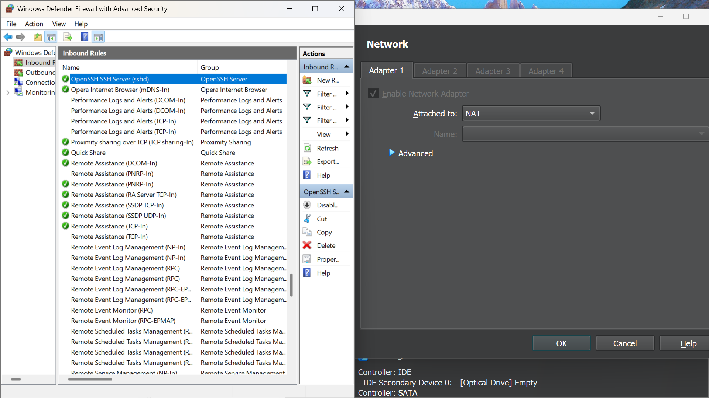
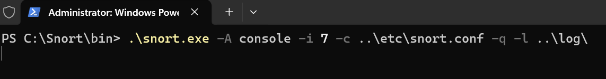
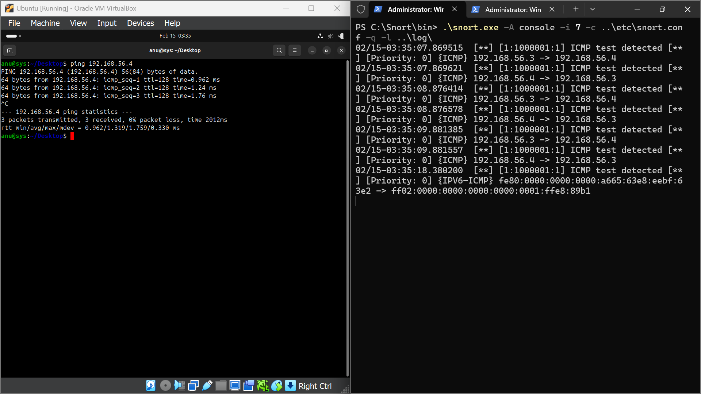
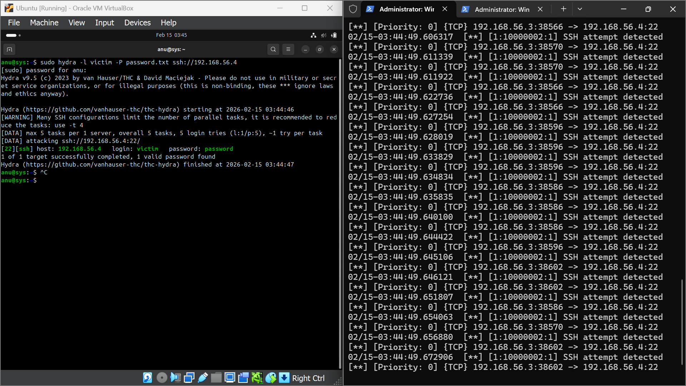
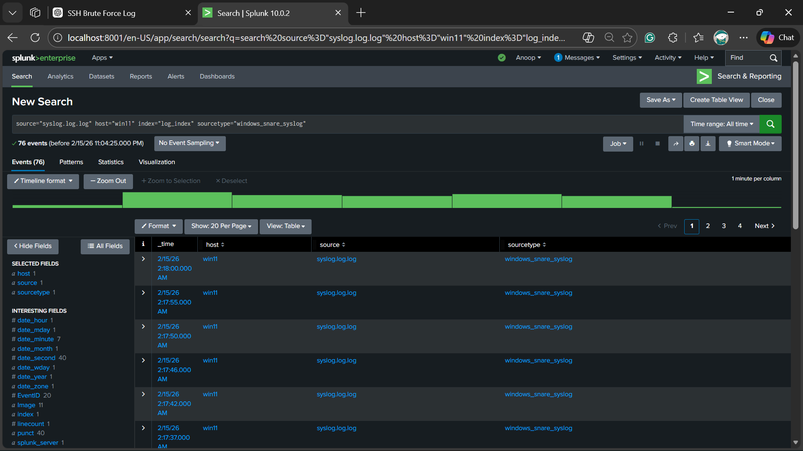
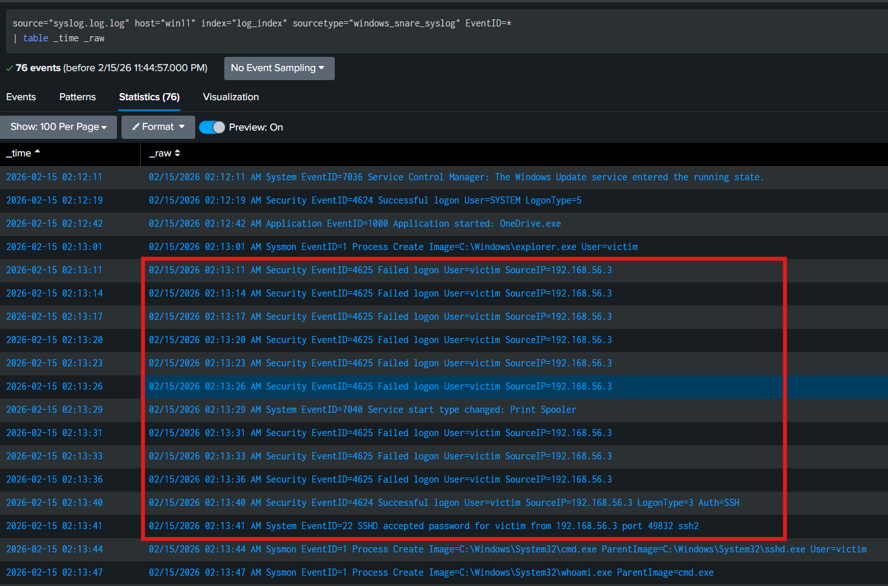
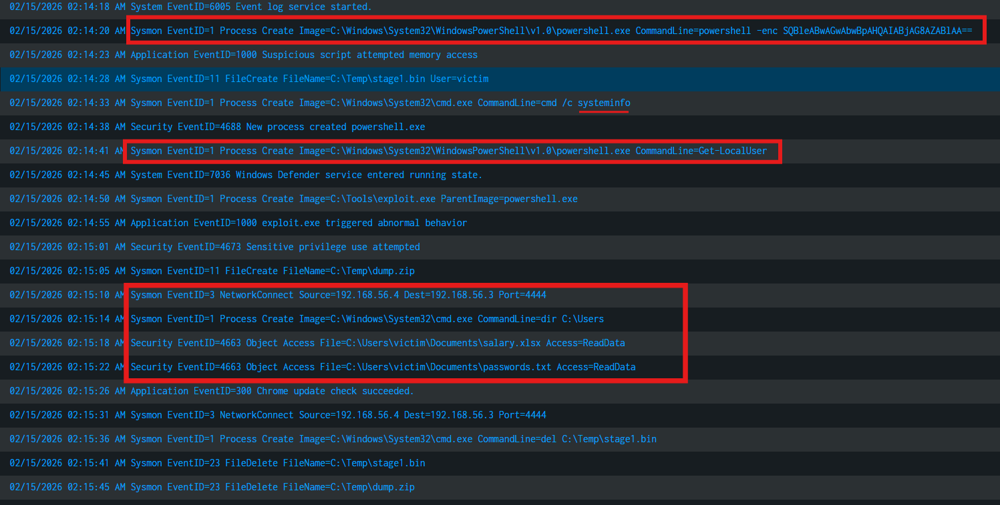
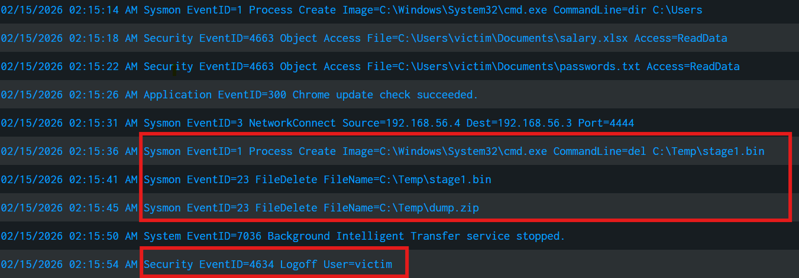

# Network-Traffic-Analysis-Using-Snort-and-Splunk

---

## Summary

**This lab demonstrates how to create a vulnerable Windows machine and configure its network on the same subnet so that we can analyze its network activity using Snort and review logs using Splunk.**  
**In this scenario, the attacker machine is running Ubuntu OS and the victim machine is running Windows 11 OS. We will configure Snort on the Ubuntu system within the same subnet as the Windows machine so that we can monitor network alerts. Then, we will analyze those logs using Splunk and create Indicators of Compromise (IOCs) based on the detected attack.**

---
## Objective

**To demonstrate the working of Snort (IDS/IPS) and Splunk (a log analysis platform) through a practical lab with real examples.**

---

## Prerequisite

**My Ubuntu is running in Virtual Box and its network configuration is set to NAT (Network Address Translation). For the victim machine, I created a new domain on my host machine just for this lab purpose and configured its firewall with some custom inbound rules. We need to allow SSH on port 22 from Windows and select NAT in VirtualBox (see attachment for reference).**

#### Reference



---

## Ubuntu

### Step 1


**To install Snort and other tools, use the following commands:**

```
sudo apt install snort -y
sudo apt install hydra -y
sudo apt install ssh -y
```

---

### Step 2

**Configuring rules in Snort initially to detect pings**

```
alert icmp any any -> any any (msg:"ICMP ping detected"; sid:1000001; rev:1;)
```

```
sudo snort -T -c /etc/snort/snort.conf
```

---

### Step 3

```
sudo snort -A console -q -c /etc/snort/snort.conf -i enp0s3
```

---

### Step 4



```
ping 192.168.56.4
```

---

### Attachment



---

### Rule

```
alert tcp any any -> any 22 (msg:"SSH attempt detected"; sid:1000002; rev:1;)
```

```
sudo hydra -l victim -P password.txt ssh://192.168.56.4
```

---

### Attachment



---

### Drop Rule

```
drop tcp any any -> any 22 (msg:"SSH attempt detected & dropped"; flags:S; sid:1000003; rev:1;)
```

---

### IPS Mode Setup

```
sudo sysctl -w net.ipv4.ip_forward=1
sudo iptables -I FORWARD -j NFQUEUE --queue-num 0
sudo snort -Q --daq nfq --daq-var queue=0 -c /etc/snort/snort.conf -i eth0
```

---

## Splunk Analysis

Upload logs via:

```
Settings > Add Data > Upload File > Search
```



Search query:

```
EventID=* | table _time _raw
```



Encoded command detected:

```
powershell -enc SQBleABwAGwAbwBpAHQAIABjAG8AZABlAA==
```





---

## Indicators of Compromise

**Attacker IP:** 192.168.56.3

**Authentication**
- Multiple failed logins (4625)
- Successful login (4624)

**Commands Executed**
- cmd.exe
- whoami
- net user
- systeminfo

**Sensitive Files Accessed**
- salary.xlsx
- passwords.txt

**Attack Pattern**
Brute force → login → recon → exploit → file access → exfiltration

---

## Conclusion

**This lab demonstrates how Snort and Splunk can be used together to detect attacks, analyze logs, and investigate incidents in a SOC-style workflow.**
